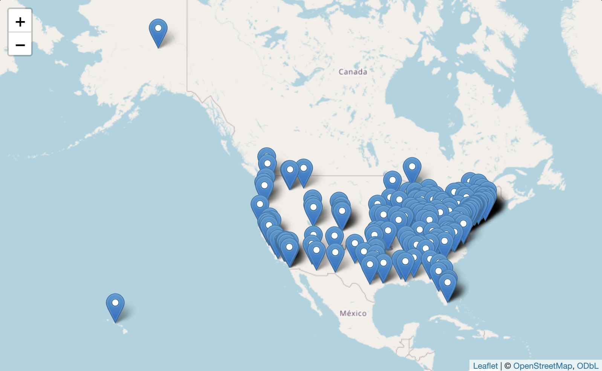
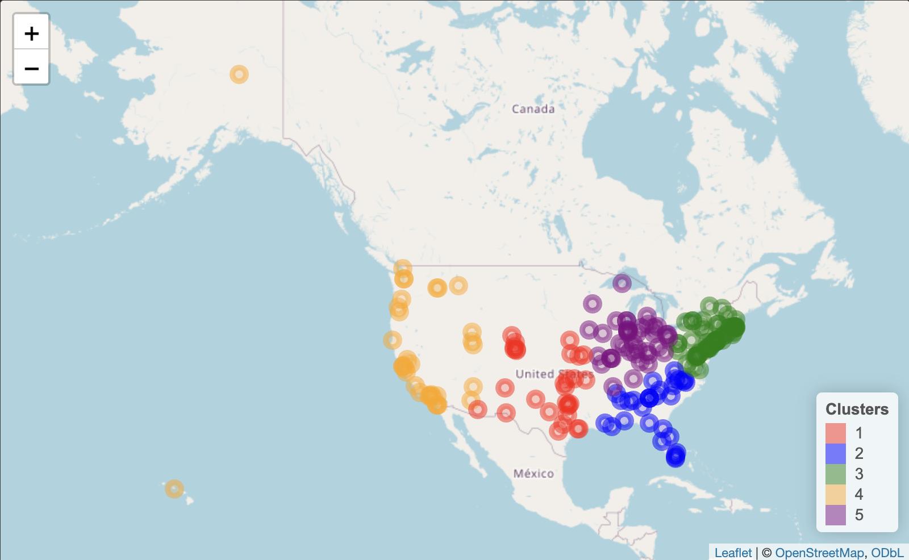

```{r setup, include=FALSE, tidy=TRUE}
knitr::opts_chunk$set(echo = FALSE, cache = TRUE, 
                      autodep = TRUE, cache.comments = FALSE,
                      message = FALSE, warning = FALSE,
                      fig.width = 7, fig.height = 5)
```


```{r error=FALSE, warning=FALSE, message=FALSE}
library(dplyr)
library(rvest)
library(httr)
library(stringr)
library(memoise)
library(jsonlite)
library(cachem)
library(RSelenium)
library(leaflet)
library(geosphere)
library(googleway)
library(ggplot2)
library(ggmap)
library(stringdist)
library(mapview)
```

# Geospatial Network Analysis of U.S. Universities’ Competitiveness 
<br>

## Abstract 

This project aims to conduct a comprehensive geospatial and competitive analysis of universities listed in the U.S. News school rankings. By leveraging Google Maps data, we intend to create a matrix that encapsulates the driving distances between each pair of universities, treating the institutions as nodes within a network. The values within the matrix will represent the shortest driving distances, transforming the network’s edges from binary indicators to quantifiable distances. This project will provide valuable insights for prospective students, educators, and policymakers into the competitive landscape of higher education institutions in the United States. It will also highlight the potential regional dynamics that could influence university admission policies and strategies. <br>


## Introduction

In recent years, the landscape of higher education in the United States has undergone a significant transformation, marked by a heightened level of competitiveness among universities. This transformation has been driven by several factors, including globalization, advancements in technology, and evolving student preferences. As a result, universities are no longer confined to competing solely within their regions; they are now vying for students on a national and even global scale. This paper aims to delve into the intricate dynamics of this competitiveness by examining three key aspects: the geographic proximity of universities, their rankings, and their admission standards. <br>

The American higher education system has long been regarded as one of the most prestigious and sought-after in the world. With a diverse range of institutions, from Ivy League universities to state colleges and private liberal arts schools, students have numerous options when pursuing higher education. However, as the demand for quality education has grown both domestically and internationally, universities have found themselves engaged in fierce competition to attract the brightest minds. <br>

In this evolving landscape, geographic proximity has emerged as a crucial factor influencing student choices and university strategies. Traditionally, universities competed primarily with institutions within their immediate geographic vicinity. However, advancements in transportation and communication technologies have diminished the barriers of distance, allowing universities to compete on a broader scale. This paper will explore how the geographic distribution of universities across the United States impacts their competitive positions. <br>

Additionally, university rankings have gained increasing importance in recent years. Organizations such as U.S. News & World Report provide annual rankings of colleges and universities, which are closely scrutinized by students, parents, educators, and policymakers. These rankings often play a pivotal role in shaping institutional reputations and attracting prospective students. Hence, understanding how rankings correlate with other factors, such as geographic proximity and admission standards, is essential to comprehending the competitive landscape of higher education. <br>

Furthermore, admission standards, particularly the emphasis on standardized test scores like the SAT (Scholastic Assessment Test), are critical in shaping a university's student body. Different institutions place varying degrees of importance on these standardized tests during the admission process. This paper will investigate whether universities' rankings correlate with their admission standards and if regions with a higher density of universities exhibit different admission criteria compared to less competitive regions. <br>

To undertake this comprehensive analysis, a multi-faceted approach will be employed, encompassing data collection and analysis across these three critical dimensions: geographic proximity, rankings, and admission standards. <br>


## Methods

### Step 1: Acquiring Qs University Ranking from 2024 data

This initial step involves web scraping the 2024 QS World University Rankings data and locally storing it as a CSV file. Manually collecting the data reduces the need for repetitive web scraping, ensuring efficiency. We use `RSelenium` to automate web scraping from the QS World University Rankings website. The data includes the names of universities in North America.

```{r results='hide'}

# To manually store scraped data locally, as dynamically scraping Qs university ranking everytime is can be inefficient.
university_data_cache <- './cache/cache_university_data.csv'

scrape_university_data <- function(){
 
  # First closing a RSelenium server if it's already running. This can be an issue if the scraping is done multiple     times in a session
   tryCatch({
    driver$server$stop()
    print("Running Selenium driver was stopped, a new session will now be started")
  }, error = function(e){
    print("New Selenium driver to be started")
  })
  
  # Start a RSelenium server
  driver <- rsDriver(browser = "firefox")
  remote_driver <- driver[["client"]]
  
  
  # Function to scrape university names
  scrape_university_names <- (function() {
    webpage <- read_html(remote_driver$getPageSource()[[1]])
    print(html_nodes(webpage, ".uni-link"))
    universities <- webpage %>%
      html_nodes(".uni-link") %>%
      html_text()
    return(universities)
  })
  
  
  # Navigating to the URL
  url <- "https://www.topuniversities.com/world-university-rankings?region=North%20America&countries=us"
  
  remote_driver$open()
  remote_driver$navigate(url)
  
  Sys.sleep(15)
  
  # Scraping data and navigating to the next page iteratively
  all_universities <- character(0)
  load_more_exists <- TRUE
  
  while (load_more_exists) {
    
    # Getting university names
    all_universities <- c(scrape_university_names())
    
    # Clicking on the next page button if it exists
    tryCatch({
      hidden_button <- remote_driver$findElement(using="xpath", "//div[@pageno='13']")
      load_more_exists <- FALSE
      
    }, error = function(e) {
      load_more_button <- remote_driver$findElement(using="class name", value="loadmorebutton")
      load_more_button$clickElement()
      load_more_exists <- TRUE
    })
    
    # Waiting for the page to load completely before scraping data.
    Sys.sleep(15)
  }
  
  # Stopping the Selenium server
  remote_driver$close()
  driver$server$stop()
  
  university_data <- data.frame(Name = all_universities)
  write.csv(university_data, file = university_data_cache, row.names = FALSE)
  
}

# Checking if rankings are already saved in the csv file to save time if already scraped.
if (file.info(university_data_cache)$size == 0){
  scrape_university_data()
} else {
  print("Qs University Data has already been scraped and cached persistently. Pulling university data from cache file.")
  university_data <- read.csv(university_data_cache)
}

```


### Step 2 : Getting geocodes from google maps api

This step involves obtaining geographic coordinates (latitude and longitude) for each university by using the Google Maps API. These coordinates will be crucial for calculating driving distances between universities.

``` {r}

# Getting api from external api key file
source(".api-key.R")
api_key <- api$google_api_key

# Function to get coordinates for a university by name
get_university_coordinates <- function(university_name) {
  result <- google_geocode(address = university_name, key = api_key)

  # Checking if the result contains any data
  if (length(result$results) > 0) {
    location <- c(result$results$geometry$location$lat, result$results$geometry$location$lng)
    return(location)
  } else {
    return(c(NA, NA))
  }
}

# Applying the function to each university name in the data frame
university_data$Coordinates <- lapply(university_data$Name, get_university_coordinates)


```


### Step 3: Cleaning Google Maps Coordinate data

Here, the retrieved coordinates are processed to ensure consistency and accuracy. The process involves handling missing data and making sure the coordinates are in a suitable format for further analysis. 

```{r}

#Takes the first result from Google Maps
university_data$Coordinates <- lapply(university_data$Coordinates, function(x) {
  if (!any(is.na(x)) & length(x) > 2) {
    return(c(x[1], x[3]))
  } else {
    return(x)
  }
})

```


### Step 4 : Showing universities in a map

In this step, we create a map visualization using the `Leaflet` library to display the universities' locations based on the latitude and longitude coordinates obtained from Google Maps. This provides a visual representation of where the universities are situated.

```{r}

# Extracting Latitude and Longitude from Coordinate values
university_data$Latitude <- sapply(university_data$Coordinates, function(coord) coord[1])
university_data$Longitude <- sapply(university_data$Coordinates, function(coord) coord[2])

# Converting the latitude and longitude to numeric forms
university_data$Latitude <- as.numeric(university_data$Latitude)
university_data$Longitude <- as.numeric(university_data$Longitude)


# Creating a data frame for leaflet
map <- leaflet(university_data) %>%
  addTiles() %>%
  addMarkers(
    lat = ~Latitude,
    lng = ~Longitude,
    popup = ~as.character(Name)
  )

print(map)

## save html to png
mapshot(map, file = "./data/map_plot_all.png")
```

```{r include_leaflet_map, echo=FALSE, out.width="100%"}


```


### Step 5: Clustering universities based on their latitudes and longitudes

We perform clustering on the universities based on their geographic coordinates using the k-means algorithm. This step groups universities that are close to each other in terms of location into clusters, helping to identify geographical patterns in university distribution.

```{r}

# Defining the kmeans function
kmeans_cached <- memoise(function(coordinates, k) {
  kmeans(coordinates, centers = k)
})

# Extracting coordinates from the "Coordinates" column
coordinates <- matrix(unlist(university_data$Coordinates), ncol = 2, byrow = TRUE)

# Calculating within-cluster sum of squares for different values of k
calculate_wss <- function(k) {
  clusters <- kmeans_cached(coordinates, k)
  return(clusters$tot.withinss)
}

# Creating a cached version of the calculate_wss function, because as the clusters change, later driving distances would have to be fetched again, which would be inefficient for the scale of this project.
calculate_wss_cached <- memoise(calculate_wss)

# Calculating within-cluster sum of squares for different values of k
wss <- sapply(1:10, calculate_wss_cached)

# Plotting the elbow curve
plot(1:10, wss, type = "b", xlab = "Number of Clusters", ylab = "Within Sum of Squares")

# Performing k-means clustering with k=5
k <- 5
clusters <- kmeans_cached(coordinates, k)

# Adding the cluster assignment to the data frame
university_data$Cluster <- clusters$cluster

```


### Step 6: Showing the above cluster in map

This step visualizes the clusters we created in the previous step on a map using different colors to represent each cluster. It helps we visualize how universities are grouped based on their geographic proximity. We chose the k value of 5 based on 2 factors, a) the analysis of elbow plot, b) the geospatial spread of the US.  

```{r include=FALSE}
map <- leaflet(university_data) %>%
  addTiles()  

cluster_colors <- c("red", "blue", "green", "orange", "purple")

# Adding circle markers for each university with color based on cluster
map <- map %>%
  addCircleMarkers(
    lng = ~Longitude,
    lat = ~Latitude,
    color = ~cluster_colors[Cluster],
    popup = ~as.character(Name),
    label = ~as.character(Cluster),
    radius = 6
  ) %>%
  addLegend("bottomright", title = "Clusters", colors = cluster_colors, labels = 1:k)

map
```

```{r include_leaflet_map2, echo=FALSE, out.width="100%"}


```


### Step 7: Calculating Driving Distances and Analyzing Mean Distances:

In this phase, we calculate the driving distances between universities within each cluster. This is done using the Google Maps Distance Matrix API, considering both time and distance. We analyze the mean distances between universities in each cluster, providing insights into the geographical spread of universities within each group.


```{r echo=FALSE, results='hide'}

#function to fetch driving distances
fetch_distances <- function(){
  # Sourcing api key from api key file
  source(".api-key.R")
  api_key <- api$google_api_key
  
  google_distance_matrix <- function(origins, destinations) {
      google_distance(
        origins = origins,
        destinations = destinations,
        key = api_key,
        units = "imperial",
        mode = "driving"
      )
    }
  
  # Function to calculate driving distances between universities in a cluster
  calculate_distances <- function(cluster_data) {
    n <- nrow(cluster_data)
    distances <- matrix(NA, nrow = n, ncol = n)
  
    for (i in 1:(n-1)) {
      for (j in (i + 1):n) {
        result <- google_distance_matrix(
          origins = paste0(cluster_data$Latitude[i], ",", cluster_data$Longitude[i]),
          destinations = paste0(cluster_data$Latitude[j], ",", cluster_data$Longitude[j])
        )
  
        print(result$rows)
        
        tryCatch({
          print(paste(i, " ", j))
          distances[i, j] <- result$rows$elements[[1]]$distance$text
          distances[j, i] <- result$rows$elements[[1]]$distance$text
        }, error = function(e){
          distances[i, j] <- NA
          distances[j, i] <- NA
        })
          
      }
    }
  
    return(distances)
  }
  
  # For 5 clusters
  num_clusters <- 5
  cluster_distances_list <- list()
  
  count <- 0
  
  # Calculating distances for each cluster
  for (cluster_id in 1:num_clusters) {
    cluster_data <- university_data_clustered[university_data_clustered$Cluster == cluster_id, ]
    cluster_distances <- calculate_distances(cluster_data)
    count <- count + 1
    print(count)
  
    # Saving cluster distances
    cluster_distances_list[[cluster_id]] <- cluster_distances
    write.csv(cluster_distances, file = paste0("cluster_", cluster_id, "_distances.csv"))
    
    
  }
  
}

# Checks if the cluster distances files already exist. This is to avoid multiple api hits, Caching would be a good alternative, but google maps api for distance matrix doesn't allow caching. So, this is the workaround we chose.
cluster_files <- c("cluster_1_distances.csv", "cluster_2_distances.csv", 
                   "cluster_3_distances.csv", "cluster_4_distances.csv", 
                   "cluster_5_distances.csv")

file_exists <- function(file) {
  file.exists(file)
}

if (any(!sapply(cluster_files, file_exists))) {
  print ("Fetching Distances...")
  fetch_distances()
} else {
  print ("Using Locally Saved Data")
}


  
```
  

  
```{r}
## Adding row, column names for the distance matrices for individual clusters
file_names <- paste0("cluster_", 1:5, "_distances.csv")


for (i in 1:length(file_names)) {
  
  cluster_distances <- read.csv(file_names[i], row.names = 1)

  
  cluster_number <- as.numeric(str_extract(file_names[i], "\\d+"))

  
  cluster_data <- university_data_clustered[university_data_clustered$Cluster == cluster_number, ]

  
  university_names <- cluster_data$Name

  
  rownames(cluster_distances) <- university_names
  colnames(cluster_distances) <- university_names

  
  write.csv(cluster_distances, file = paste0("cluster_", cluster_number, "_distances_named.csv"))
}

```


```{r echo=FALSE, results='hide'}
## Assign Sequential Ranking to the universities
# Sequentially adding rank to the universities
for (i in 1:nrow(university_data_clustered)){
  university_data_clustered$Rank[i] <- i
}

```


```{r echo=FALSE, results='hide'}

## Finding mean driving distances between universities
university_cluster <- data.frame(ClusterID = integer(5), TotalUniversities = integer(5))
#Function to calculate mean distance for a given cluster
mean_distance <- function(cluster_id) {
  # Reading the CSV file as a matrix
  dist_matrix <- read.csv(paste0("cluster_", cluster_id, "_distances_named.csv"), header = TRUE, row.names = 1)

  # Extracting numerical values from the "mi" format
  dist_matrix <- as.matrix(sapply(dist_matrix, function(x) as.numeric(gsub(" mi", "", x))))
  
  print(mean(dist_matrix[upper.tri(dist_matrix)], na.rm = T))
  return(mean(dist_matrix[upper.tri(dist_matrix)], na.rm = T))
}

# Applying the function to each cluster
for (cluster_id in 1:5) {
  university_cluster$ClusterID[cluster_id] <- cluster_id
  university_cluster$TotalUniversities[cluster_id] <- unname(table(university_data_clustered$Cluster)[cluster_id])
  university_cluster$MeanDrivingDistance[cluster_id] <- mean_distance(cluster_id)
}


```

## Findings

```{r echo=FALSE, out.width="100%"}
# Creating a barplot with university densities for each of the clusters
ggplot(university_cluster, aes(x=factor(ClusterID), y=TotalUniversities, fill=MeanDrivingDistance)) + 
  geom_bar(stat="identity") +
  scale_fill_gradient(low="#2E3192", high="#1BFFFF") +
  theme_minimal() +
  xlab("Cluster ID") +
  ylab("Total Universities") +
  ggtitle("Universities Per Cluster & Their Densities") +
  guides(fill=guide_colorbar(title="Mean Driving Distance (mi)"))

```

The graph above attempts to compare the densities of the universities using the number of universities in a given cluster and mean driving distances between them. The lower the driving distances, higher the densities. It can be clearly observed that cluster 3 has the highest density with the most number of universities, as well as least mean driving distances between the universities. Cluster 5 then follows cluster 3 in terms of the proximity of universities with cluster 2, 4 and 1 following there after, respectively. 

```{r echo=FALSE}
# Reading IPEDS extracted data on universities and their SAT scores.
sat_scores <- read.csv("./data/university_sat_scores.csv")

# Mergining University Data with IPEDS data
university_data_clustered_sat <- merge(university_data_clustered, sat_scores, by.x = "Name", by.y = "institution.name", all.x = FALSE)

names(university_data_clustered_sat)[names(university_data_clustered_sat) == "ADM2021_RV.SAT.Evidence.Based.Reading.and.Writing.75th.percentile.score"] <- "SAT1"

names(university_data_clustered_sat)[names(university_data_clustered_sat) == "ADM2021_RV.SAT.Math.75th.percentile.score"] <- "SAT2"

university_data_clustered_sat$TotalSAT <- university_data_clustered_sat$SAT1 + university_data_clustered_sat$SAT2

university_data_all <- university_data_clustered_sat[, c("Name", "Latitude", "Longitude", "Cluster", "Rank", "TotalSAT")] 


mean_total_sat_by_cluster <- university_data_all %>%
  group_by(Cluster) %>%
  summarize(MeanSATScore = mean(TotalSAT, na.rm = TRUE))

# Joining the tables only if the new columns hasn't been created.
if("MeanSATScore" %in% colnames(university_cluster)){
  print("Already Added")
} else {
 university_cluster <- left_join(university_cluster, mean_total_sat_by_cluster, by = c("ClusterID" = "Cluster")) 
}

ggplot(university_cluster, aes(x = MeanDrivingDistance, y = MeanSATScore, color = as.factor(ClusterID))) +
  geom_point(size = 3) +
  labs(title = "Driving Distance vs. SAT Score by Cluster",
       x = "Mean Driving Distance",
       y = "Mean SAT Score",
       color = "Cluster ID") +
  scale_color_manual(values = cluster_colors)+
  theme_minimal() +
theme(
    plot.title = element_text(hjust = 0.5),  # Centered title
    axis.text.x = element_text(angle = 45, hjust = 1),  # Rotate x-axis labels
    legend.position = "right",  # Move legend to the right  
    legend.background = element_rect(fill = "white"),  # White background for legend
    legend.key = element_rect(color = "white", fill = "white"),  # White border for legend keys
  )

```

Then finally, after combining the geospatial data of the top universities with the IPEDS data for respective SAT scores, the graph attempts to visualize the mean SAT scores (75th percentile) for each of the university clusters. Comparing to the graph before this, it can be easily identified that the densities of the universities have at least some correlation with the competitiveness (measured through mean SAT scores - 75th percentile as an indicator). It can be observed that cluster 3, with the highest university density has significantly higher mean SAT scores, followed by cluster 5, cluster 2, cluster 4 and 1, respectively. This correlates directly to the order or densities observed in the prior graph. 

## Conclusion and Discussion

This project attempts to analyze how universities, their proximities and competitiveness might be correlated. And as per the initial assumption, the analysis provides some preliminary evidence on how geographical proximities affect university competitiveness and admission standards.

In the past, educational institutions primarily competed with others in their immediate geographic regions. However, in today's rapidly changing landscape of higher education, schools are no longer confined to regional competition; they are now engaged in fierce competition on both national and global scales. <br>

In this project, we measure competitiveness by assessing how many schools are located within a specific radius, typically a one-hour driving distance. To achieve this, we cluster schools based on their geographic proximity, allowing us to understand regional dynamics. However, it's important to note that even with this clustering approach, we must consider potential endogeneity issues. Focusing on top-ranked schools does not necessarily resolve these complexities because the endogeneity issue extends to various dimensions. <br>

One challenge with region-based clustering is that areas with a high concentration of schools often begin with a higher population density. This inherent correlation between school and population density presents a unique challenge in our analysis. <br>

In future work, assessing neighboring schools for fluctuations in the numbers and proportions of international students can provide additional insights. Numerous hypotheses can be rigorously tested in this framework. It is crucial to retain only those universities with nearby peers (e.g., within a 200-mile radius) for analysis. <br>

Furthermore, exploring the changes over time, particularly by examining two distinct waves (the most recent wave and an arbitrary prior wave), can illuminate variations in SAT scores, rankings, and the composition of students (e.g., out-of-state students and international students). Analyzing variance and mean values, such as whether universities collectively advance in rankings, would be able to draw comprehensive conclusions. <br>

In summary, this analytical approach allows for a nuanced examination of the competitive dynamics among universities, considering geographical proximity, SAT scores, and demographic compositions. By investigating variations and trends, this study holds the potential to unearth valuable insights into the shifting landscape of higher education institutions. Despite recognizing there is room for improvement in our methodology, we firmly believe this project offers valuable insights. It gives prospective students, educators, and policymakers a deeper understanding of the competitive landscape within higher education institutions in the United States. Furthermore, it sheds light on the intricate regional dynamics that have the potential to shape university admission policies and strategies in meaningful ways. <br>

\newpage

## Reference

Altbach, P. G., & Salmi, J. (2011). The Road to Academic Excellence: The Making of World-Class Research Universities. World Bank Publications. <br>

Creswell, J. W., & Creswell, J. D. (2017). Research Design: Qualitative, Quantitative, and Mixed Methods Approaches. SAGE Publications. <br>

Dougherty, K. J., & Natow, R. S. (2016). Understanding the Cost Structures of Online Higher Education: Implications for Efficiency and Accessibility. Educational Policy Institute. <br>

Elwert, F., & Winship, C. (2014). Endogenous selection bias: The problem of conditioning on a collider variable. Annual review of sociology, 40, 31-53. <br>

NACAC (National Association for College Admission Counseling). (2021). College Admission Testing: A Comprehensive Review of the Literature and Policy Implications.  https://www.nacacnet.org/globalassets/documents/publications/research/college-admission-testing-literature-review.pdf <br>

Imai, K. (2018). Quantitative social science: an introduction. Princeton University Press. <br>

Kothari, C. R. (2004). Research Methodology: Methods and Techniques. New Age International. <br>

Stevens, M. L. (2007). Creating a Class: College Admissions and the Education of Elites. Harvard University Press. <br>

Treiman, D. J. (2014). Quantitative data analysis: Doing social research to test ideas. John Wiley & Sons. <br>

U.S. News & World Report. (2022). Best Colleges Rankings. https://www.usnews.com/best-colleges. <br>

VanDerWerf, S. (2020). Colleges Are No Match for American Poverty. The Chronicle of Higher Education. https://www.chronicle.com/article/colleges-are-no-match-for-american-poverty


